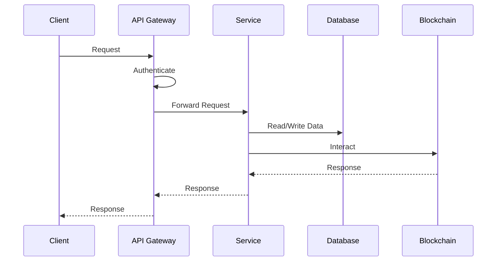
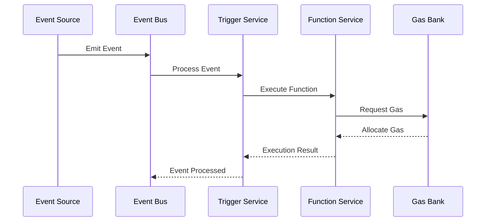

# Neo N3 Service Layer Architecture Guide

## Overview

The Neo N3 Service Layer is designed as a modular, scalable, and resilient system that provides serverless capabilities for the Neo N3 blockchain. This guide explains the architecture, components, interactions, and design decisions.

## System Architecture

### 1. High-Level Architecture

```
┌─────────────────────────────────────────────────────────────────┐
│                        Client Applications                       │
└───────────────────────────────┬─────────────────────────────────┘
                                │
┌───────────────────────────────▼─────────────────────────────────┐
│                            API Layer                            │
│  ┌─────────────┐   ┌─────────────┐   ┌─────────────┐           │
│  │   REST API  │   │ GraphQL API │   │ WebSocket   │           │
│  └─────────────┘   └─────────────┘   └─────────────┘           │
└───────────────────────────────┬─────────────────────────────────┘
                                │
┌───────────────────────────────▼─────────────────────────────────┐
│                         Service Layer                           │
│  ┌─────────────┐   ┌─────────────┐   ┌─────────────┐           │
│  │  Functions  │   │  Triggers   │   │  Gas Bank   │           │
│  └─────────────┘   └─────────────┘   └─────────────┘           │
│  ┌─────────────┐   ┌─────────────┐   ┌─────────────┐           │
│  │ Price Feed  │   │   Secrets   │   │  Monitoring │           │
│  └─────────────┘   └─────────────┘   └─────────────┘           │
└───────────────────────────────┬─────────────────────────────────┘
                                │
┌───────────────────────────────▼─────────────────────────────────┐
│                      Infrastructure Layer                        │
│  ┌─────────────┐   ┌─────────────┐   ┌─────────────┐           │
│  │  Database   │   │    Cache    │   │   Queue     │           │
│  └─────────────┘   └─────────────┘   └─────────────┘           │
│  ┌─────────────┐   ┌─────────────┐   ┌─────────────┐           │
│  │  Storage    │   │  Metrics    │   │   Logging   │           │
│  └─────────────┘   └─────────────┘   └─────────────┘           │
└───────────────────────────────┬─────────────────────────────────┘
                                │
┌───────────────────────────────▼─────────────────────────────────┐
│                         Neo N3 Blockchain                        │
└─────────────────────────────────────────────────────────────────┘
```

### 2. Component Architecture

#### API Layer
- REST API for standard HTTP requests
- GraphQL API for flexible data queries
- WebSocket API for real-time updates
- Authentication and authorization
- Rate limiting and caching
- Request validation and transformation

#### Service Layer
- Functions Service for serverless execution
- Triggers Service for event-based automation
- Gas Bank Service for gas management
- Price Feed Service for market data
- Secrets Service for sensitive data
- Monitoring Service for system health

#### Infrastructure Layer
- Database for persistent storage
- Cache for performance optimization
- Queue for asynchronous processing
- Storage for file management
- Metrics for monitoring
- Logging for debugging

## Service Components

### 1. Functions Service

```yaml
# Architecture of Functions Service
functions:
  components:
    - name: Function Manager
      responsibility: Function lifecycle management
      operations:
        - create_function
        - update_function
        - delete_function
        - list_functions
    
    - name: Runtime Engine
      responsibility: Function execution
      operations:
        - execute_function
        - terminate_function
        - monitor_execution
    
    - name: Resource Manager
      responsibility: Resource allocation
      operations:
        - allocate_resources
        - release_resources
        - monitor_usage
```

### 2. Triggers Service

```yaml
# Architecture of Triggers Service
triggers:
  components:
    - name: Trigger Manager
      responsibility: Trigger lifecycle management
      operations:
        - create_trigger
        - update_trigger
        - delete_trigger
        - list_triggers
    
    - name: Event Processor
      responsibility: Event handling
      operations:
        - process_event
        - validate_event
        - route_event
    
    - name: Scheduler
      responsibility: Time-based triggers
      operations:
        - schedule_trigger
        - execute_schedule
        - manage_timezone
```

### 3. Gas Bank Service

```yaml
# Architecture of Gas Bank Service
gas_bank:
  components:
    - name: Balance Manager
      responsibility: Gas balance tracking
      operations:
        - check_balance
        - update_balance
        - transfer_gas
    
    - name: Allocation Manager
      responsibility: Gas allocation
      operations:
        - allocate_gas
        - release_gas
        - track_usage
    
    - name: Policy Manager
      responsibility: Gas policies
      operations:
        - enforce_limits
        - apply_rules
        - monitor_compliance
```

## Data Flow

### 1. Request Flow



### 2. Event Flow



## Scalability

### 1. Horizontal Scaling

```yaml
# Scaling Configuration
scaling:
  services:
    functions:
      min_replicas: 2
      max_replicas: 10
      metrics:
        - type: cpu
          target: 70
        - type: memory
          target: 80
    
    triggers:
      min_replicas: 2
      max_replicas: 5
      metrics:
        - type: queue_length
          target: 1000
    
    gas_bank:
      min_replicas: 2
      max_replicas: 3
      metrics:
        - type: requests
          target: 1000
```

### 2. Load Balancing

```yaml
# Load Balancer Configuration
load_balancer:
  algorithm: round_robin
  health_check:
    path: /health
    interval: 30s
    timeout: 5s
    unhealthy_threshold: 3
  
  ssl:
    enabled: true
    certificate: acm
  
  rules:
    - path: /api/v1/*
      service: api
      port: 3000
    
    - path: /ws/*
      service: websocket
      port: 3001
```

## High Availability

### 1. Fault Tolerance

```yaml
# Fault Tolerance Configuration
fault_tolerance:
  circuit_breaker:
    threshold: 50
    timeout: 30s
    reset: 300s
  
  retry:
    max_attempts: 3
    backoff:
      initial: 1s
      max: 60s
      multiplier: 2
  
  fallback:
    enabled: true
    cache_ttl: 300s
```

### 2. Disaster Recovery

```yaml
# Disaster Recovery Configuration
disaster_recovery:
  backup:
    schedule: "0 0 * * *"
    retention: 30d
    type: full
  
  replication:
    enabled: true
    type: async
    regions:
      - primary: us-east-1
        secondary: us-west-2
  
  recovery:
    rto: 1h
    rpo: 15m
```

## Security

### 1. Network Security

```yaml
# Network Security Configuration
network:
  firewall:
    enabled: true
    rules:
      - source: 10.0.0.0/8
        ports: [3000, 3001]
        action: allow
  
  encryption:
    in_transit: true
    at_rest: true
    key_rotation: 90d
  
  access:
    private_link: true
    vpn: true
```

### 2. Application Security

```yaml
# Application Security Configuration
security:
  authentication:
    methods:
      - jwt
      - api_key
    mfa: true
  
  authorization:
    rbac: true
    resource_policies: true
  
  audit:
    enabled: true
    retention: 365d
```

## Best Practices

1. **Service Design**
   - Follow microservices principles
   - Implement proper isolation
   - Design for failure
   - Maintain service boundaries

2. **Data Management**
   - Use appropriate storage
   - Implement caching
   - Handle transactions
   - Manage consistency

3. **Scalability**
   - Design for horizontal scaling
   - Implement load balancing
   - Monitor performance
   - Handle state properly

4. **Reliability**
   - Implement fault tolerance
   - Design for recovery
   - Monitor health
   - Test resilience

5. **Security**
   - Secure communication
   - Protect data
   - Control access
   - Monitor threats

6. **Monitoring**
   - Track metrics
   - Monitor logs
   - Set up alerts
   - Analyze trends

## Support

For architecture support:
- Email: architecture@neo-service-layer.io
- Discord: [Neo Service Layer Community](https://discord.gg/neo-service-layer)
- GitHub Issues: [Report a bug](https://github.com/will/neo_service_layer/issues)

## Additional Resources

- [System Design](./SYSTEM_DESIGN.md)
- [Component Guide](./COMPONENTS.md)
- [Integration Guide](./INTEGRATION.md)
- [Scaling Guide](./SCALING.md)
- [Security Guide](./SECURITY.md) 