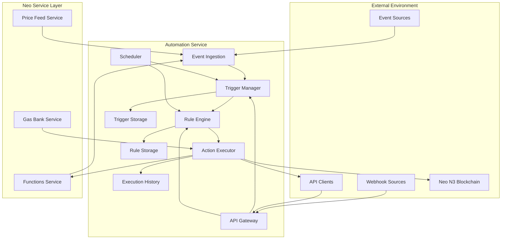
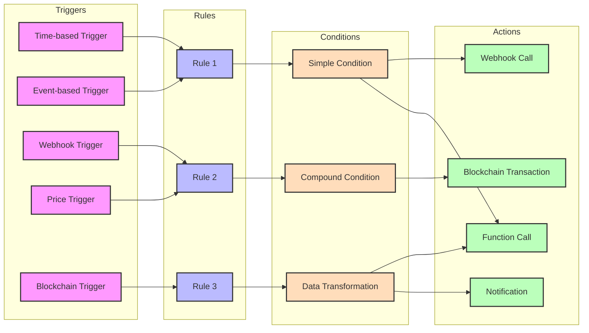
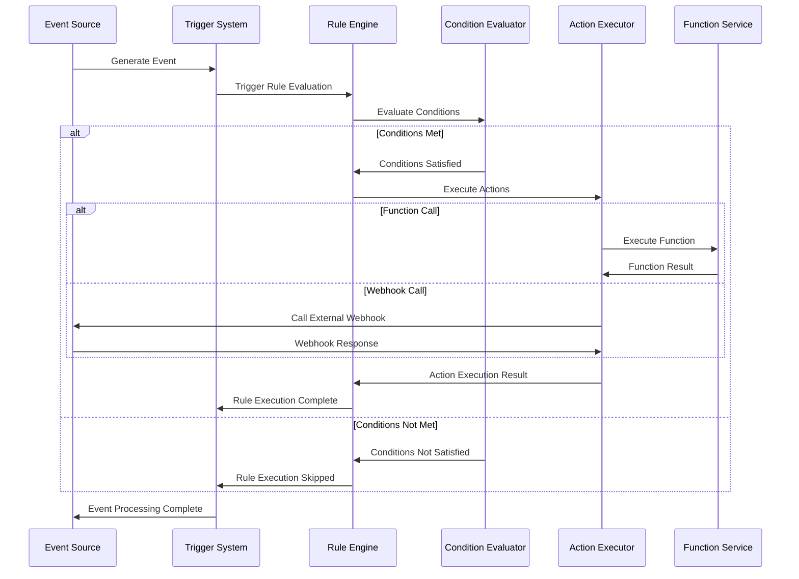
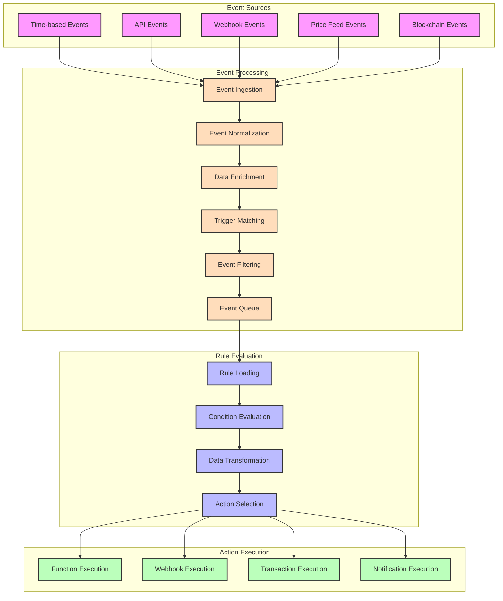
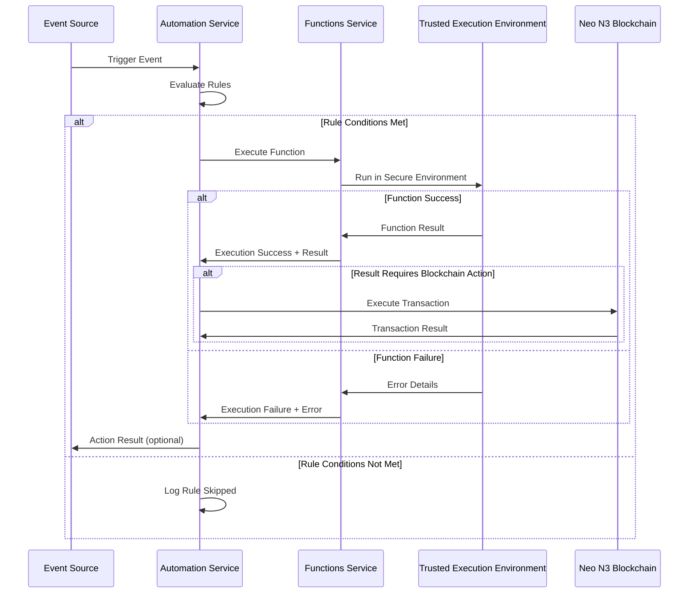
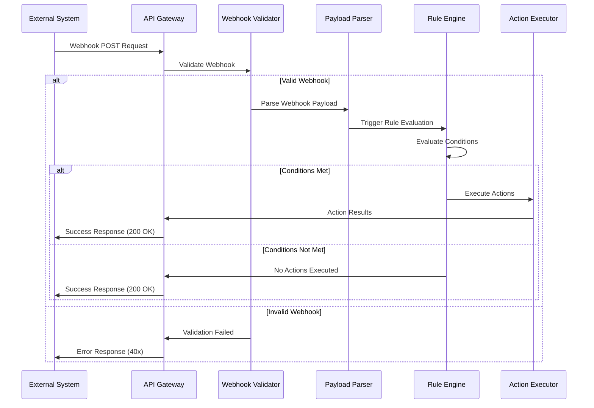

# Automation Service: Diagrams

*Last Updated: 2025-04-14*

*Last updated: 2024-05-15*

This document contains diagrams and visual representations of the Automation Service architecture, trigger-action flows, rule evaluation processes, and integration patterns. These diagrams help visualize how the service works and how to use it effectively.

## Table of Contents

- [Service Architecture](#service-architecture)
- [Trigger-Rule-Action Flow](#trigger-rule-action-flow)
- [Rule Evaluation Process](#rule-evaluation-process)
- [Event Processing Pipeline](#event-processing-pipeline)
- [Integration with Functions Service](#integration-with-functions-service)
- [Webhook Processing](#webhook-processing)
- [Common Automation Patterns](#common-automation-patterns)

## Service Architecture

The following diagram illustrates the high-level architecture of the Automation Service:

## Trigger-Rule-Action Flow

Diagram showing the relationship and flow between triggers, rules, and actions:

## Rule Evaluation Process

This diagram shows how rules are evaluated:

## Event Processing Pipeline

Diagram showing how events are processed in the Automation Service:

## Integration with Functions Service

Visualization of how the Automation Service integrates with the Functions Service:

## Webhook Processing

Diagram showing how webhooks are processed:

## Common Automation Patterns

Visual representation of common automation patterns:

```mermaid
flowchart TD
    subgraph PatternA ["Scheduled Execution"]
        TimeTriggerA[Scheduled Trigger]
        FunctionA[Data Processing Function]
        ResultA[Data Storage]
    end
    
    subgraph PatternB ["Event-Driven Processing"]
        EventTriggerB[Event Trigger]
        RuleB[Filtering Rule]
        FunctionB[Event Handler Function]
        ResultB[Action Response]
    end
    
    subgraph PatternC ["Price Monitoring"]
        PriceTriggerC[Price Trigger]
        ConditionC[Threshold Condition]
        NotificationC[Notification Action]
        TradeC[Trading Action]
    end
    
    subgraph PatternD ["Smart Contract Automation"]
        BlockchainTriggerD[Blockchain Trigger]
        RuleD[Validation Rule]
        FunctionD[Transaction Function]
        ResultD[Contract Interaction]
    end
    
    TimeTriggerA --> FunctionA
    FunctionA --> ResultA
    
    EventTriggerB --> RuleB
    RuleB --> FunctionB
    FunctionB --> ResultB
    
    PriceTriggerC --> ConditionC
    ConditionC --> NotificationC
    ConditionC --> TradeC
    
    BlockchainTriggerD --> RuleD
    RuleD --> FunctionD
    FunctionD --> ResultD
    
    classDef trigger fill:#f9f,stroke:#333,stroke-width:2px
    classDef process fill:#bbf,stroke:#333,stroke-width:2px
    classDef result fill:#bfb,stroke:#333,stroke-width:2px
    
    class TimeTriggerA,EventTriggerB,PriceTriggerC,BlockchainTriggerD trigger
    class FunctionA,RuleB,FunctionB,ConditionC,RuleD,FunctionD process
    class ResultA,ResultB,NotificationC,TradeC,ResultD result
```

## Using These Diagrams

These diagrams can be rendered in GitHub and other platforms that support Mermaid markdown. You can also copy the Mermaid code and use it in tools like:

- [Mermaid Live Editor](https://mermaid.live/)
- [GitHub Repositories](https://docs.github.com/en/get-started/writing-on-github/working-with-advanced-formatting/creating-diagrams)
- Documentation tools that support Mermaid

To embed these diagrams in other documentation, simply copy the Mermaid code blocks.
