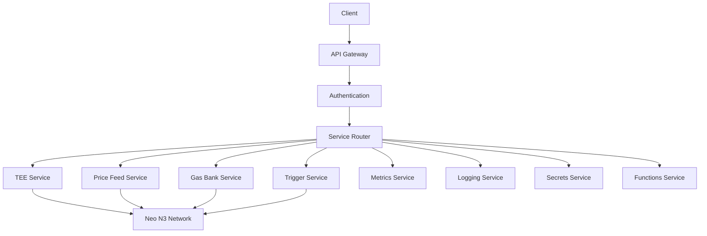

# Neo Service Layer Documentation

## Overview
The Neo Service Layer is a centralized service infrastructure for Neo N3 blockchain, providing essential services. This service layer includes:

- Trusted Execution Environment (TEE) for secure computation
- Price feed service for real-time price data
- Gas bank service for gas management
- Trigger service for event monitoring
- Metrics and logging services
- Secrets management service
- Functions service for custom logic
- RESTful API service

## Architecture
The service layer is built with security and scalability in mind:

## Security Model
- All user functions execute in TEE
- Authentication via Neo N3 wallet signatures
- No traditional login/registration - all authentication through blockchain
- Secure secret management with proper permission controls
- Contract automation

## Documentation Structure
- [Utilities](./utils/README.md)
  - [TEE Integration](./utils/tee.md)
  - [Neo N3 Utilities](./utils/neo.md)
  - [Vault Management](./utils/vault.md)
  - [Authentication](./utils/auth.md)
  - [Logging](./utils/logger.md)
  
- [React Hooks](./hooks/README.md)
  - [Wallet Integration](./hooks/useWallet.md)
  - [Toast Notifications](./hooks/useToast.md)

## Getting Started
1. Clone the repository
2. Install dependencies: `npm install`
3. Set up environment variables
4. Start development server: `npm run dev`

## Contributing
Please read our [Contributing Guidelines](./CONTRIBUTING.md) before submitting pull requests.

## License
This project is licensed under the MIT License - see the [LICENSE](./LICENSE) file for details.